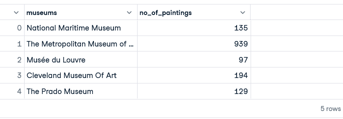

# Famous museum painting analysis

---

## Introduction
This is a sql project analysis on **museum paintings**. I came across this dataset on meduim which took me to kaggle, i found it a rich data as i have been trying to get my hands dirty with a dataset to practice my skills in sql.

## Problem Statement
1. How many paintings are not displayed on any museums?
2. How many paintings have an askin price of less than their regular price?
3. Whose painting asking price is less than 50% of its regular price?
4. Which canva size cost the most?
5. Which museums are open on both sundays and mondays?
6. How many museums are open every single day?
7. Top 5 most popular museums, popularity is based on the most number of paintings in a museum?
8. The top 10 most famous paintings subject?
9. What are the top most popular artist. Popularity is based on the most number of paintings done by the artist?
10. Artist whose paintings are displayed in multiple countries?

## Data sourcing
Downloaded the Dataset From kaggle, see the dataset [Here](/https://www.kaggle.com/datasets/mexwell/famous-paintings) , extracted it into datalab for analysis. 
Used about 6 csv files (product size, museum, museum hours, artist, work,subject), which included different columns and rows.

##Data Transformation
Data was trasformed with the sql editor inside Datalab on datacamp.

## SQL query and Output

### 1. How many paintings are not displayed on any museums?
Query:

    <select work_id, name

    from 'work.csv'

    where museum_id is null>

### Output

### 2. How many paintings have an asking price of less than their regular price?
Query:

    <select w.name, p.sale_price, p.regular_price

    from 'work.csv' as w

    inner join 'product_size.csv' as p

    on w.work_id = p.work_id

    where p.sale_price < p.regular_price

    limit 25>

### Output

### 3. Whose paintings asking price is less than 50% of its regular price?
Query:

    <select w.name, p.sale_price, Round    (regular_price/2.0) as avg_regular_price

    from 'product_size.csv' as p

    join 'work.csv' as w

    on p.work_id = w.work_id

    Where p.sale_price < avg_regular_price>

### Output

### 4. Which canva size cost the most?
Query:

    <select max(max_sale_price) as maximum_canvas_price

    from (

    select c.size_id, MAX(CAST(p.sale_price AS DOUBLE)) as max_sale_price, p.regular_price 

    from 'product_size.csv' as p

    join 'canvas_size.csv' as c

    on TRY_CAST(p.size_id AS INT64) = TRY_CAST(c.size_id AS INT64)

    group by c.size_id, p.regular_price

    ) as subquery;>

### Output

### 5. Which museums are open on both sundays and mondays?
Query:

    <SELECT m.name

    FROM 'museum.csv' m

    WHERE EXISTS (

    SELECT 1

    FROM 'museum_hours.csv' mh1

    WHERE mh1.museum_id = m.museum_id AND mh1.day = 'sunday'

    )

    AND EXISTS (

    SELECT 1

    FROM 'museum_hours.csv' mh2

    WHERE mh2.museum_id = m.museum_id AND mh2.day = 'monday'

    )>

### Output 

### 6. How many museums are open every single day?
Query:

    <SELECT mh.day, COUNT(DISTINCT m.museum_id) AS open_museums

    FROM 'museum.csv' m

    JOIN 'museum_hours.csv'mh 

    ON m.museum_id = mh.museum_id

    GROUP BY mh.day

    ORDER BY mh.day;

    >

### Output

### 7. Top 5 most popular museums, popularity is based on the most number of paintings.
Query:

    <with cte as (

    select m.museum_id, m.name as museum_name, w.name as painting_name

    from 'museum.csv' m

    join 'work.csv' w

    on m.museum_id = w.museum_id

    order by w.name
    )

    select museum_name as museums, count(painting_name) as no_of_paintings

    from cte

    group by museum_id, museum_name

    limit 5>

### Output

### 8. The top 10 famous painting subject
Query:

    <select  subject, top_10_subject

    from (select subject, count (subject) as top_10_subject

	 from 'subject.csv'

	  group by subject)

    order by top_10_subject desc

    limit 10>

### Output

### 9. What are the top most popular artist. Popularity is based on the most number of paintings done by the artist
Query:

    <WITH cte AS (

    SELECT w.artist_id, ar.full_name AS artist_name, COUNT(w.name) AS popular

    FROM "work.csv" w

    JOIN "artist.csv" ar

    ON ar.artist_id = w.artist_id

    GROUP BY w.artist_id, ar.full_name

    )

    SELECT artist_name, popular as top_10_popular_artist

    FROM cte

    ORDER BY popular DESC

    LIMIT 10>

### Output

### 10. Artist whose paintings are displayed in multiple countries
Query:

    <WITH artist_museums AS (

    SELECT ar.artist_id, ar.full_name AS artist_name, COUNT(DISTINCT w.museum_id) AS museum_count

    FROM "work.csv" w

    JOIN "artist.csv" ar

    ON ar.artist_id = w.artist_id

    GROUP BY ar.artist_id, ar.full_name

    )

    SELECT artist_name, museum_count

    FROM artist_museums

    WHERE museum_count > 1

    ORDER BY museum_count DESC

    Limit 10>

### Output

